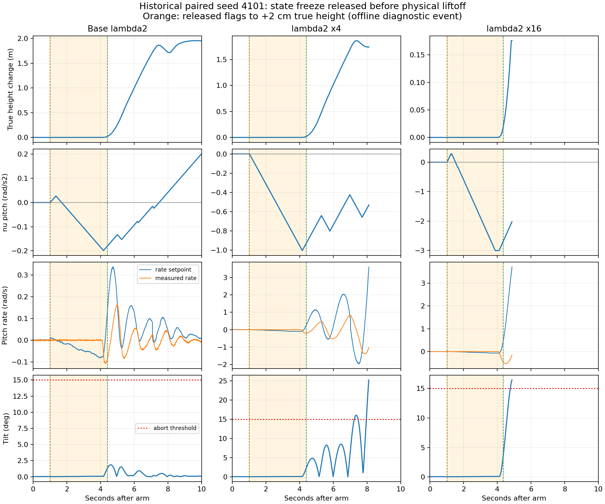

# ISTA-OPT02：起飞积分机制诊断与局部搜索（2026-09-18）

## 结果概述

按用户要求先诊断、再执行预注册局部搜索：**64次新Gazebo尝试全部完成起飞、悬停激励、降落并通过日志/安全检查，但未找到综合性能满足目标的参数**。停止状态 `no_training_eligible_candidate`，没有进入独立验证，没有更换日常参数，也没有修改飞控/保护/land detector、push或实机部署。

定位到一个可复核的风险机制：**landed/maybe_landed解除不等于实际离地，触地期间nu已经开始积分；较大的lambda2放大这段积累，离地后形成不利偏置，伴随pitch与外环纠偏振荡。** 未发现解析求根或冻结代码违反当前约定。新种子分轴干预全部成功，也证明不能把结论写成“lambda2增大必然失稳”或“已证明这是唯一根因”。

这是固定ESTA、额外ISTA预算的后续开发研究，不覆盖M10等预算结果。原M10/OPT01已公开，是开发知识；新训练不是未见正式测试。原有失败全部保留，既有数据目录只读。

## 1. 原失败到底发生在哪里

OPT01的21次失败中：18次最后事件为takeoff_command，2次为hold_command_after_takeoff，1次旧B/ISTA低pitch-lambda1候选C00在hover_start后失败。提高lambda2的20次失败均未完成后续悬停/降落，不能声称“已测出降落失败”。本轮的64次完整起降另计。

对同一历史seed4101的C01原参数、C02三轴lambda2×4、C03×16做只读ULog核对。所有初始nu正确清零；进入landed或maybe_landed时冻结正确；未出现数值/时间fault。物理高度用Gazebo真值，只用于离线诊断，未馈入控制器。

| 历史配置 | 冻结解除至真值高度+2cm | 解锁第4秒pitch nu (rad/s²) | armed最大倾角 |
| --- | ---: | ---: | ---: |
| C01 原A增益 | 3.392 s | −0.18464 | 1.8667° |
| C02 lambda2×4 | 3.384 s | −0.95232 | 25.2051° |
| C03 lambda2×16 | 3.332 s | −3.00000，达到上限 | 16.4521° |

“+2cm”是诊断用离地邻域事件，不是精确接触力消失时刻。另单独统计高度差<2mm、|vz|<.02m/s的静止地面阶段，确认不是把已飞行的3秒误当触地。高频离线最大倾角与原宿主轮询中止时读到的倾角略不同，两者不混用；15°中止阈值不保证物理状态绝不超过15°。



图中橙色区间为冻结解除到真值高度+2cm。注意各列纵轴刻度不同；曲线在中止后不延伸。lambda2×4的pitch振荡逐渐放大，×16在离地后很快超限。

## 2. 机制与代码定位

1. [MulticopterLandDetector.cpp:208](../../../src/modules/land_detector/MulticopterLandDetector.cpp#L208)用推力门槛等条件判断ground_contact；推力上升时这些状态可以先于物理离地解除。这不是一个直接的接触传感器，不宜直接判定为上游代码错误。
2. [StaProtection.cpp:89](../../../src/modules/mc_rate_control/StaRateControl/StaProtection.cpp#L89)在armed、rate_enabled且非landed/maybe_landed时允许更新nu，没有实际离地的附加条件。当前代码正确执行了原里程碑约定，但该约定没有覆盖所有触地约束。
3. [IstaRateControl.cpp:110](../../../src/modules/mc_rate_control/StaRateControl/IstaRateControl.cpp#L110)按 `nu_next = nu − h*lambda2*xi` 更新。非滑动分支|xi|=1，即使速率误差不大，也会持续按lambda2积累。在地面，机体不能像自由飞行的正输入增益对象一样响应。
4. [StaProtection.cpp:163](../../../src/modules/mc_rate_control/StaRateControl/StaProtection.cpp#L163)的方向冻结依据mixer饱和反馈；它不能识别地面反作用力。历史C01/C02的静止地面样本没有该限制，C03最终触发nu上限。保护没有“失效”，而是保护判据不覆盖触地约束。
5. 离地后外环要求反向pitch纠偏，但先前负nu仍存在，抵消部分即时纠偏项，随后日志出现速率设定值和实际速率的振荡。这里“反向偏置”指nu分量，不是说每个时刻的总力矩都方向错误。

历史3轮及新8轮以独立double二分求解核对原始ISTA候选；新8轮最大a偏差<1.0e-7 rad/s²、nu候选偏差<5.0e-8 rad/s²，land冻结状态逐样本相等，诊断序列无缺失、fault=0。理想候选与受保护输出仍分开，不把受保护输出称为严格隐式解。

证据支持“触地阶段积累和初始条件敏感性”这条机制；**没有做隔离的离地前nu冻结固件消融，不能声称已证明它解释全部失稳、或修复它后一定可用大lambda2。** 也未单独识别接触力、外环、电机动态对失稳的因果贡献。

## 3. 新分轴干预：8/8成功，支持积累机制但否定必然失效说法

固定lambda1=[2.2,2.4,1.5]、同inertia场景，种子5101/5102；每seed内随机配置顺序。D0原增益，D1仅pitch lambda2×4，D2仅roll/yaw×4，D3三轴×4。

| 配置 | 地面pitch ν绝对值峰值：5101 / 5102 (rad/s²) | +2cm时pitch nu：5101 / 5102 | 起降接受 |
| --- | ---: | ---: | ---: |
| D0 原增益 | 0.2544 / 0.1437 | +0.2723 / +0.0538 | 2/2 |
| D1 仅pitch×4 | 0.6106 / 0.3507 | +0.4879 / −0.2637 | 2/2 |
| D2 仅R/Y×4 | 0.2435 / 0.1133 | +0.2602 / +0.0691 | 2/2 |
| D3 三轴×4 | 0.7373 / 0.4442 | +0.5186 / +0.2432 | 2/2 |

D1的地面pitch积累约为D0的2.40/2.44倍，D2没有同样放大；实际轨迹改变后不能要求nu严格变为4倍。D3两个新种子离地时偏置为正，历史失败seed4101则为大负值。此对照说明符号、幅值和初始误差历史共同影响结果，而不是单看lambda2数值决定成败。所有新干预最大倾角≤1.746°。

详细记录：[旧3轮](../ista_opt02/results/diagnosis_previous.json)、[新8轮](../ista_opt02/results/diagnosis_audit.json)、[诊断门槛](../ista_opt02/results/diagnosis_gate.json)。

## 4. 低lambda2局部搜索

先提交[协议](../ista_opt02/PROTOCOL_CN.md)，完整范围12个固定候选见[candidates.json](../ista_opt02/results/candidates.json)：lambda2=[.05,.08,.02]保持或减半；六套lambda1在R=2.2/2.6、P=2.4/2.8/3.2、Y=1.5/1.8之间按预定组合变化。经验起点是OPT01的C01，不称整个区间已证明安全。g、nu/命令限幅、外环、传感器滤波和模型不变。

- 独立速率对象12候选×6条件=72个有界数值检查通过，不作为起降安全证明或新的排名依据。
- 新训练seed5201/5202，固定ESTA六场景×两种子=12/12通过。
- 12候选inertia/div4、seed5201筛查24/24通过，按既定几何均值排名取L10、L09。
- 两候选各补10次，其余20/20通过；每名完整12次，筛查两次复用不重复计样本。
- 总计8诊断+12对照+24筛查+20补充=64/64接受，无失败/回退/日志特批/协议偏离。最大armed倾角3.1308°、悬停高度误差.11679m。
- 与上轮不同种子、不同搜索范围，不能把0失败对比21失败直接解释为失效率的因果改善；也不形成实机安全保证。

L09：lambda1=[2.2,2.8,1.8]，lambda2=[.05,.08,.02]。L10：lambda1=[2.6,3.2,1.8]，lambda2=[.025,.04,.01]。二者均不推荐直接替换默认参数。

主指标为两个训练种子平均后再取三轴平均RMSE，单位rad/s；以下为候选筛选后的训练描述统计，不是独立验证。

| 场景 | 固定ESTA | L09 | L09相对变化 | L10相对变化 |
| --- | ---: | ---: | ---: | ---: |
| 标准 | .0037233 | .0038319 | +2.92% | +11.21% |
| 力矩扰动 | .0038228 | .0039802 | +4.12% | +6.28% |
| 惯量增加 | .0036471 | .0037049 | +1.59% | +44.59% |
| 噪声增加 | .0050976 | .0052572 | +3.13% | +5.04% |
| 二分频 | .0038976 | .0043107 | +10.60% | +13.31% |
| 四分频 | .0044332 | .0056336 | +27.08% | +25.28% |

两候选主指标改善场景均0/6。L09四分频pitch比值1.7979；L10该项1.8155，均超过预设单轴1.25门槛。L09的yaw单轴在六场景均较低，改善约0.4%～11.4%，但不足以补偿pitch退化。L09的三轴平均TV/s在前五场景增加约3.2%～11.5%，四分频减少10.3%；不能把ISTA一概描述成“总是更平滑”。

因此停止，验证seed5301…5303未使用；本任务不包含20种子正式论文留出。未运行的36次验证不计为成功，不调整目标或扩预算继续追求胜出。所有候选、小项指标、IAE、控制RMS/峰值、饱和、TV/频谱和成本见[完整汇总](../ista_opt02/results/summary.json)。

## 5. 版本、测试、证据与复现

- 运行源码/预注册提交：`defb4c7696cc3a776a7e9c19dc53b48c3104f82f`，研究分支，所有新仿真运行时工作区干净。
- 固件SHA-256：`9e1ecd6caed29e2105b14c66ddff5c042113c5515304bb0df3e9abe993dcc1a4`。插件manifest：`e10aab329615926555f50fedd8a4392330c54fcec078df1bd2f234186d8981c2`。均逐轮核对，ULog内嵌源码一致。
- 90个C++、74个既有Python和17个优化Python测试通过（共91个Python，未重复计数）；6011独立参考样本、SITL编译通过。命令与退出码见[verification.json](../ista_opt02/results_evidence/verification.json)及[优化测试输出](../ista_opt02/results_evidence/optimizer_tests.log)。
- 新128个ULog指纹逐个核对；旧3轮的6个ULog另做只读指纹核对。汇总独立执行两次，生成的JSON文件逐字节一致；图经实际渲染检查，没有把中止后时间补成正常飞行。
- 14个scene/seed组内前5000个gyro噪声样本逐位相同、最大差0；不同seed的实现有差异。仅显式播种IMU和力矩相位；GPS/磁力计/气压计及宿主调度不声称独立受控。
- 接受轮次原motor_limits累计缺失88,829样本；沿用原协议实际更新诊断/已消费饱和状态做分析，不以ULog dropout=0冒充原话题无损。
- 核函数/模块成本保留，但主机并未独占/锁频，训练期间也有离线绘图；这些是SITL宿主描述性成本，不是板载实时性或精密性能基准。
- 外部数据 `/home/yr/Desktop/codev doc/experiments/ISTA-OPT02-20260918`：3,209文件、2,207,788,572字节（约2.21GB）。[全量索引](../ista_opt02/results_evidence/artifacts.sha256)自身SHA-256：`dbe6783e3cab46c3148688b30f38486ffeb756fbbda70851b175fc27d486fee8`，全量校验通过。原始ULog不进Git。
- 结束时无存活仿真，最后运行读回MODE=0、AXES=0、DIV=1、MC_RATT_TEST=0、SDLOG_PROFILE=131。原M10/OPT01、日常sim_scripts、控制器/保护/模型源码均未修改；未执行MATLAB或实机验证。

运行入口：[RUN_CN.md](../ista_opt02/RUN_CN.md)。后处理（沿用该文档PYTHONPATH，图额外加载M10已有plot_dependencies01/python）：

```bash
python3 research/sta-rate-control/scripts/summarize_ista_opt02.py \
 --root '/home/yr/Desktop/codev doc/experiments/ISTA-OPT02-20260918/run01' \
 --output '<全新汇总目录>'
python3 research/sta-rate-control/scripts/plot_ista_takeoff.py --output '<全新图目录>'
sha256sum --check --quiet research/sta-rate-control/ista_opt02/results_evidence/artifacts.sha256
```

结果提交的SHA记录在外部进度表；它不是本轮运行的固件提交。若继续，建议单独设计起飞阶段nu管理的隔离消融，验证是否能降低初始条件敏感性；这是控制行为变更，需独立授权、生命周期/时序回归和重新冻结比较基准。本轮没有擅自加入真值触地判断、空中切换参数或按场景增益调度，也不能保证这种改动会解决四分频性能退化。
