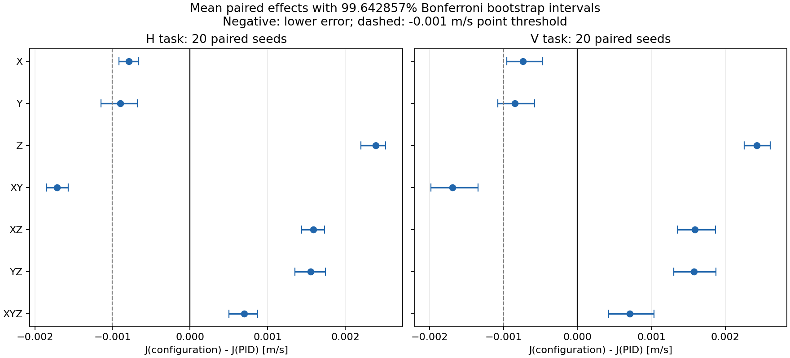

# AX05：速度环按轴消融结果

2026-10-09，仅Gazebo Iris SITL。**320轮全部接受、280配对检查通过，320独立回放、640份ULog解码/指纹通过。** 无补飞、换种子、追加调参或改阈值。初始容量不足已解决，历史证据保留在报告和preflight.json。

## 通俗结论

保持位置环、姿态环、角速度环不变，只把速度控制X/Y/Z按七种组合换成ESTA，与全PID比较。每轴参数跨组合固定，不是每组重新调到最优。
H是定高水平8字，V是同水平轨迹加小幅升降。每任务8配置×20配对种子=160轮。
主指标为三轴速度RMSE算术平均J（m/s），越小越好，不是位置误差或最大误差。

| 配置 | H J | 对PID | V J | 对PID |
|---|---:|---:|---:|---:|
| PID | .007155 | 基准 | .007160 | 基准 |
| X ESTA | .006364 | 降低11.1% | .006426 | 降低10.3% |
| Y ESTA | .006256 | 降低12.6% | .006315 | 降低11.8% |
| Z ESTA | .009546 | 增加33.4% | .009586 | 增加33.9% |
| XY ESTA | .005439 | 降低24.0% | .005473 | 降低23.6% |
| XZ ESTA | .008742 | 增加22.2% | .008747 | 增加22.2% |
| YZ ESTA | .008711 | 增加21.8% | .008735 | 增加22.0% |
| XYZ ESTA | .007856 | 增加9.8% | .007870 | 增加9.9% |

**本次最合适的是XY ESTA＋Z PID。** XY满足两个任务的预定配对统计和实用改善条件；X/Y单独替换方向也改善，但绝对改善未达预设.001m/s。
加入当前Z ESTA后，Z速度误差约为PID的3.8倍，Z输出变化量约48倍；XYZ不是更好的答案。XY也有代价：水平输出变化量约翻倍。TV不是电池能耗。
结论只适用于当前参数、模型、小幅任务，不证明所有ESTA/实机结果相同。



## 数据入口

- [完整报告](../../reports/AX05.md)、[全组次指标](results/SECONDARY_CN.md)：逐轴误差、位置/高度/yaw、三类TV、频谱及宿主成本。
- [320轮指标](results/metrics.json)、[全部统计/区间/探索性交互](results/summary.json)、[实际模式/状态](results/actual_states.json)。
- [640份ULog索引](results/ulog_index.json)、[证据指纹](results/evidence_index.json)、[原容量预检](preflight.json)。
- 外部原件：`/home/yr/Desktop/codev doc/experiments/VELOCITY-AXIS-ABLATION-20261008/AX05/`。formal01为飞行，replay01为独立回放，audit01为全日志审计。每轮`spectra.json`为原生/共同频谱，回放指纹一致。

飞行源码794301664cc0aacee6b5c62987531ab6f0b33fdf；结果SHA见外部进度。320预算已完成，**不要再次启动正式飞行入口**。不push、不继续V09/ISTA/实机。

## 只读复现（不飞行）

输出目录须为新路径，脚本拒绝覆盖。完整重分析需要保留外部原始日志和冻结插件/资格。

```bash
cd /home/yr/Desktop/Codev-autopilot
export PYTHONPATH="$PWD/.px4-python:/home/yr/Desktop/codev doc/experiments/M00-20260912/python${PYTHONPATH:+:$PYTHONPATH}"
export PATH="$PWD/.px4-python/bin:$PATH"
AX05_DATA='/home/yr/Desktop/codev doc/experiments/VELOCITY-AXIS-ABLATION-20261008/AX05'
python3 -m unittest discover -s research/sta-velocity-control/axis_ablation/ax05 -p 'test_*.py' -v
python3 research/sta-velocity-control/v08/evidence_tools/replay_batch.py \
  "$AX05_DATA/formal01" --protocol research/sta-velocity-control/axis_ablation/ax04 \
  --output "$AX05_DATA/replay_user01"
python3 research/sta-velocity-control/axis_ablation/ax04/collect.py \
  --batch "$AX05_DATA/formal01" --replay "$AX05_DATA/replay_user01" \
  --output "$AX05_DATA/outcomes_user01.json"
python3 research/sta-velocity-control/axis_ablation/ax04/package.py \
  --outcomes "$AX05_DATA/outcomes_user01.json" --output "$AX05_DATA/summary_user01.json"
```

全部原始日志另做独立完整解码：

```bash
python3 research/sta-velocity-control/axis_ablation/ax05/audit_results.py \
  --batch "$AX05_DATA/formal01" \
  --qualification "$AX05_DATA/../AX04/qualified_source.json" \
  --output "$AX05_DATA/audit_user01"
```

仅重新导出既有统计/图表（不重新计算指标或飞行）：

```bash
export PYTHONPATH="$PYTHONPATH:/home/yr/Desktop/codev doc/experiments/M10-20260917/plot_dependencies01/python"
python3 research/sta-velocity-control/axis_ablation/ax05/export_results.py \
  --external "$AX05_DATA" --output "$AX05_DATA/export_user01"
```

本次最终命令退出0；报告披露首次容量汇总exit2及缺绘图库导出exit1。图表仅展示既有统计，不代替模式/时间/日志检查。
