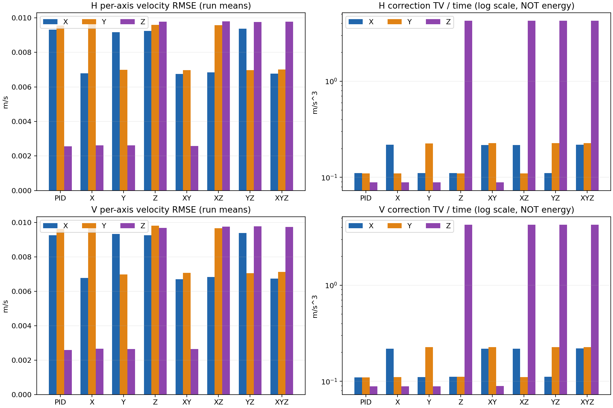

# AX05：正式轴消融完成（仅 Iris SITL）

最终更新：2026-10-09。**协议完整执行、飞行/日志/开发风险验收通过；不是所有ESTA配置性能获胜。**
320计划/320尝试/320真实起飞/320完成起降/320接受，0失败/无效/缺失/补飞；H/V各160接受、140配对，总280配对。
320轮独立重分析通过，640份启动/飞行ULog完整解码无corruption/dropout，18,564个原始工件指纹已保存。参数精确恢复，无残留PX4/Gazebo。

结论：本次固定参数、低幅轨迹和模型下，**XY ESTA＋Z PID** 的综合速度误差最低，H/V相对PID降低23.98%/23.57%，满足预定义改善条件。
XYZ虽然安全完成，但综合误差比PID增加9.80%/9.91%，Z纠偏TV/T约为PID的48倍。不能写“替换轴越多越好”或“ESTA全面优于PID”。

[简明总结](../axis_ablation/ax05/README_CN.md)｜[全部统计](../axis_ablation/ax05/results/summary.json)｜[逐轮指标](../axis_ablation/ax05/results/metrics.json)｜[全组次指标](../axis_ablation/ax05/results/SECONDARY_CN.md)｜[证据索引](../axis_ablation/ax05/results/evidence_index.json)。

## A. 来源与实际执行

- 正式协议/实际运行源码：**794301664cc0aacee6b5c62987531ab6f0b33fdf**，资格凭据仍为AX04原件；实际固件SHA256 `3c31069dc295edfa535b87909e39544d09a42acb2c54182421324e435386fa09`。
- 宿主分支 `research/sta-velocity-control`，结果开工HEAD **688815a6dd029a485bbb25502bc58400d5c91083**（容量阻塞文档提交）。没有回退/重建用户分支；结果SHA提交后写外部进度。
- 初始38.10GiB不足时0尝试，用户释放空间后约109.32GiB并明确“继续AX05”。未删除/压缩/搬移历史数据；原阻塞报告在下方保留。
- 外部`isolate.sh`在私有user/mount写时复制层运行真实冻结HEAD，UID1000、同绝对源码路径，不隔离网络/PID/时钟。宿主只读lower，upper为`/home/yr/.cache/px4-ax05-isolation01`。仅在该环境保留原分支后创建7943016研究分支；没有伪造Git返回、放宽资格或改宿主引用，飞行期间未修改宿主仓库。
- 初始离线缓存曾在实验目录，飞前完整移到.cache，避免同一源码挂载别名重复计种子；未排除实际历史扫描/新增种子豁免。该执行环境安排已披露，不是控制/参数/阈值偏离。脚本/授权SHA保留。
- preflight02核对500仓库资产/7外部依赖、33子模块、原资格，实跑81 Python/10 C++通过；`DONT_RUN=1 make px4_sitl_default gazebo_iris -j4`退出0，固件SHA未变。
- 唯一外部根：`/home/yr/Desktop/codev doc/experiments/VELOCITY-AXIS-ABLATION-20261008/AX05/`。原`ax04/run.py --execute --source-head 794301664cc0aacee6b5c62987531ab6f0b33fdf --authorization …/authorization01.json --output …/formal01`执行，不重启/补飞。
- 首轮完成2026-10-08 08:13:18 UTC，末轮完成2026-10-08 22:34:21 UTC（北京时间10月9日06:34:21）。发现完成后只做离线收尾，未额外飞行。

## B. 固定条件、任务与预算

PID/X/Y/Z/XY/XZ/YZ/XYZ分别MODE0/AXES0或MODE1/AXES1…7。位置P、姿态/rate PID固定，rate MODE0/AXES0/DIV1/TEST0、旧起飞管理0；速度DIV1，实测99.9912–100.0022Hz，不称250Hz。
水平PID P/I/D=2.16/.48/.24，Z PID=4/2/0；XY ESTA λ1/λ2=.5/.1、νmax=.4、amax=.8；Z ESTA=2/1/4/6。每轴跨组合不变、无调参；单位和完整参数见原AX04八配置。不重复除质量，不用rate的g映射。
含Z组保留地面/ramp PID和有界交接；64s主窗已接管，实际pid_axes=7 XOR axes，XYZ主窗为0。HTE约.70458–.71035，估计轨迹不是逐轮相同。
沿用`./sitl/run.sh --headless --backend gazebo --model iris`，Gazebo Classic、1×、empty_grey.world、合格派生接触Iris及原种子插件；模型/插件SHA不变，不是DP1000实机。
H为固定yaw、约2.5m定高水平8字；V为同水平轨迹叠加包络化小幅升降（不超过.1m）。主窗64s和两个32s风险窗，原90–92s观察及起降/稳定交接保留。唯一目标源、合法XY目标、一次FF及位置P不变；**共同外部轨迹不等于实际合成v_sp逐样本相同**。
20新配对IMU种子52001–52020跨H/V使用，不是40独立块。H160通过才V160，冻结Williams平衡次序PCG64 62001；后到PID触发该块配对门，不把等待配对当失败。原V08/V09及41001–41020隔离，预算增加0、替换样本0、参数/阈值变化0。

| 任务 | 计划/尝试/起飞/起降完成/接受 | 失败/无效/缺失 | 配对 |
|---|---|---|---:|
| H | 160/160/160/160/160 | 0/0/0 | 140 |
| V | 160/160/160/160/160 | 0/0/0 | 140 |
| 总计 | 320/320/320/320/320 | 0/0/0 | 280 |

每配置每任务计划/尝试/接受20，完整配对n=20。接受率/计划完成率20/20；Wilson95描述区间约[83.9%,100%]，不是可靠性认证。无实际缺失，但接受条件化和首败停止设计的潜在偏差仍须披露。

## C. 全部主比较

J=(RMSE_X+RMSE_Y+RMSE_Z)/3，m/s，使用实际消费测量/目标及sample时间加权64s主窗；不是位置误差或三个RMSE平方平均开方。
Δ=配置J−PID J，负值更好。20块联合bootstrap200000次、seed62002，14比较共享块索引。百分比均用同20完整配对，没有开发数据。

| 配置 | H J | H对PID | V J | V对PID |
|---|---:|---:|---:|---:|
| PID | .00715497 | 基准 | .00716044 | 基准 |
| X | .00636433 | 降低11.05% | .00642623 | 降低10.25% |
| Y | .00625637 | 降低12.56% | .00631469 | 降低11.81% |
| Z | .00954599 | 增加33.42% | .00958551 | 增加33.87% |
| XY | .00543886 | 降低23.98% | .00547291 | 降低23.57% |
| XZ | .00874184 | 增加22.18% | .00874691 | 增加22.16% |
| YZ | .00871134 | 增加21.75% | .00873540 | 增加22.00% |
| XYZ | .00785582 | 增加9.80% | .00786990 | 增加9.91% |

以下14族Bonferroni约99.642857% bootstrap区间单位m/s、全部n=20。95%描述CI及100000次seed62003探索性符号翻转p/校正p完整保存在summary.json，不事后挑选检验。

| 对PID | H Δ [调整CI] | V Δ [调整CI] |
|---|---|---|
| X | −.00079064 [−.00091566,−.00065987] | −.00073421 [−.00095804,−.00047251] |
| Y | −.00089860 [−.00114764,−.00067607] | −.00084575 [−.00107577,−.00057918] |
| Z | +.00239102 [.00220416,.00252337] | +.00242507 [.00225805,.00260588] |
| XY | −.00171611 [−.00184618,−.00156965] | −.00168753 [−.00197914,−.00134511] |
| XZ | +.00158688 [.00143969,.00173298] | +.00158646 [.00135059,.00186968] |
| YZ | +.00155638 [.00135139,.00174460] | +.00157496 [.00130266,.00187612] |
| XYZ | +.00070085 [.00050066,.00087354] | +.00070946 [.00042521,.00103792] |

只有XY满足预设改善≥.001m/s、≥10%、调整CI上界<0及20完整配对。X/Y方向改善，但绝对点改善未达.001，不称合格实用改善。小样本bootstrap近似不保证严格覆盖/FWER；符号翻转对称/可交换假设未自动证明，仅敏感性分析。

## D. 逐轴、耦合和控制代价

完整16格逐轴速度/位置/yaw/高度、三类TV、共同带宽与成本见[全组次指标](../axis_ablation/ax05/results/SECONDARY_CN.md)；逐轮ν峰值、实际状态/HTE/掩码保留，不只展示综合分数。

- XY的X/Y RMSE：H .006749/.006981，对PID .009328/.009568；V .006697/.007075，对PID .009253/.009633。Z仍PID约.00259/.00265m/s，并非三个轴都改善。
- XYZ的Z RMSE：H .009789、V .009740，对PID .002569/.002595，约3.81/3.75倍；Z纠偏TV/T为4.238/4.235m/s³，对PID .08851/.08830，约47.9/48.0倍。**TV不是能耗**。
- XY水平纠偏TV/T约PID两倍，跟踪改善有输出波动代价。主窗约束比例均0，不宣称所有飞行阶段没有保护动作。
- 水平位置RMSE约2.4–2.8cm、Z约4.2cm，yaw RMSE约.00014–.00015rad。V相对固定2.5m的高度RMSE含命令升降，不等于高度目标跟踪误差，后者看位置Z；不能从速度误差推断位置同比改善。
- XYZ−XY条件增量H +.00241695、V +.00239699m/s，仅说明已有XY时增加当前Z配置变差。完整块全因子平均X/Y效应负、Z约+.0024；所有交互点估计（约10⁻⁵–10⁻⁴）在JSON探索性全报，不证明普遍解耦或显著交互。
- 每轮`spectra.json`保留原生频率/PSD及共同频带结果，320轮回放谱逐一指纹一致。共同513tap/8Hz Blackman FIR→25Hz、各端裁2.56s、0–7Hz RMS与约100Hz原生波动分开；分析重采样不修复日志有效性。
- H核路径p95运行均值：PID1.596/XY3.135/XYZ3.058µs，模块15.210/17.503/16.775µs；V核2.227/4.217/4.192、模块21.791/23.544/23.648µs。全部median/p95/p99/max及每仿真秒成本见JSON。字段名含_ns但汇总已为µs，未重复换算；这些是运行分位数的均值，不是合并分位数、板级CPU/WCET。

## E. 证据、测试及失败记录

- 外部formal01保留ledger、逐轮result/参数/目标/控制台/ULog/metrics；audit01/artifacts.json索引18,564工件。仓库保存640日志路径/字节/SHA、320指标/状态、统计和图，不提交大日志/二进制。
- 原冻结replay_batch.py按ax04独立分析320次，全部exit0、数值一致。13份metrics字节相同，307份仅cli_receipts.counts的set键顺序不同；原冻结比较器不归一化数值，原件不改写。
- 新audit_results.py只复用AX03逐ULog decoder/raw_evidence，不调用其48轮验收；另验证320清单、280完整配对检查和资格。640份全topic解码无dropout/corruption，主窗实际MODE/AXES/互补PID轴、内环PID一致，逐轮确认起飞；不等于所有物理上游采样无损。
- local/attitude下游匹配最低99.9889%、最大缺口20ms，符合原80%/≤.25s标准；姿态白名单双时钟/reset政策保持，未全话题去重。
- preflight01容量汇总exit2但81 Python/10 C++通过；容量解决后preflight02 exit0、同81/10再次通过。新增结果17 Python（11审计＋6导出/数据/谱回归）通过，原AX04 40/AX03 12又通过但已包含飞前81，**合计98个不同Python和10 C++**，不套用历史273/710。
- 构建、回放、全日志审计、AX04 collect/package、最终导出/测试退出0。第一次绘图导出缺matplotlib退出1，尚未创建结果目录；使用旧M10已安装绘图库路径后exit0，未安装/改变冻结统计依赖。一次文档patch因同文件两操作被拒，未改数据，随后分开修正；均不是飞行失败。
- 两图实际打开检查；320原生/共同频谱回放一致。冻结500+7资产、33子模块内部状态复核通过。EEPROM SHA仍`06a022de820f43ba6b9559c90da62d16326de448d19a19254c268c328fa113fc`，无残留仿真。live模式依据ULog/逐轮参数，不拿宿主EEPROM冒充live状态。

实际命令/只读复现见[README](../axis_ablation/ax05/README_CN.md)，[最终检查记录](../axis_ablation/ax05/final_checks.json)保存真实退出码/测试日志指纹；关键原件路径/SHA见evidence_index.json，完整topic计数/工件SHA在外部audit01。未执行新的生产控制回归整套273/710、MATLAB、V09、ISTA、实机或额外飞行。

## F. 限制与提交

仅IMU播种，其他噪声/宿主调度不完全配对；同块跨两任务不增加独立n。H先V后有时段效应，组内平衡不能全消除。历史调参/开发曝光存在，这是固定每轴参数的轴配置消融，不是每组合等预算最优性能比赛。CI近似、IMU种子独立性和实机外推均受限。
没有用正式数据调参、追加样本直到显著或删除不利结果。当前结果支持限定工况的XY方案，不代表所有算法/工况通用排名；强机动、风/质量/分频和实机均未测试。
本次明确提交范围为结果审计/导出/测试、轻量结果和报告入口；生产控制/保护/参数/模型、AX04冻结工具和V08包零改动。审查后结果提交，完整SHA写外部进度；不push、不跨阶段、默认PID不变。
下方原容量阻塞记录保留当时“未执行”的含义，不覆盖本次完成结论。

---

## 历史原报告：执行前容量阻塞

2026-10-08。**状态 blocked_storage，不是实验通过，也不是飞行失败。**
用户已明确授权 AX04 的精确320次；本次不需要逐轮飞行确认，但完整执行所需磁盘不足。
计划320、尝试0、起飞0、接受0、未执行320；H/V两门均未启动。没有启动Gazebo、占用正式种子或创建formal01。

## 1. 前置与冻结来源

已完整读取专项TODO/提示词/实时进度、主计划共同规则、AX03/AX04报告、正式包及统计/顺序规范。
旧经验审计沿用AX00记录；没有把历史AX03飞行或AX04测试计为本次完成。
核对分支 `research/sta-velocity-control`，开工及离线核验结束HEAD均为 **794301664cc0aacee6b5c62987531ab6f0b33fdf**，工作区干净、33递归子模块版本一致且内部干净。之后仅新增本报告/证据/入口文档。
AX03的48轮开发通过与AX04的冻结资格未被改判。用户授权仅AX05，不含V09、分频、ISTA或实机。

- 正式[清单](../axis_ablation/ax04/manifest.json)、[统计规范](../axis_ablation/ax04/STATISTICS_CN.md)、[执行入口](../axis_ablation/ax04/README_CN.md)不变：8配置×H/V×20配对块=320次，H160→V160。
- 固定每轴参数、原位置P/姿态/rate PID、速度及rate DIV1，含Z的地面PID和有界交接不变。没有调参、删组、改顺序、补飞或增加预算。
- `freeze.py --check`实际通过：500仓库资产、7外部依赖、模型/world/插件/分析器/环境与冻结一致。
- 固件实际文件及外部归档SHA256均为 `3c31069dc295edfa535b87909e39544d09a42acb2c54182421324e435386fa09`；生成版本头匹配冻结HEAD，资格证据文件SHA核验一致。没有重构建或更新资格凭据。
- execution SHA256 `308aa5a4e52828585bbf6ee3ec0be339a8081475663ceb759de0aee40167d2d3`；frozen SHA256 `0cf4d1a6626ed0cb19ce7cf0af822fe16f9a9fb70f3d3209dfe8d51cd7695f3a`。
- 资格凭据SHA256 `7f8cc14635d33f635e87cb6fc2023c494793fd39a576d3437244842d0d3b3e59`。该凭据仍绑定AX04源码，不能被新的文档提交替代。
- EEPROM前后SHA256均为 `06a022de820f43ba6b9559c90da62d16326de448d19a19254c268c328fa113fc`。默认值叠加持久化参数经原 `check_parameters` 核验：MC_RTC_MODE=0、MC_STA_AXES=0、MC_RTC_DIV=1、MC_RATT_TEST=0、MC_STA_TKO_MGT=0、MPC_VC_DIV=1。**这是离线参数证据，不是新的live effective日志。**
- 新鲜种子历史审计38969份JSON、962处精确指纹设计登记，无未豁免冲突；种子未被飞行消费。原V08/V09及其种子保持隔离。

## 2. 为什么没有启动正式批次

记录时磁盘根分区剩余 **40,905,502,720字节（约38.10 GiB）**。
用同模型、同日志链、同任务时长的AX03完整48次数据作容量外推，`du -s --block-size=1`不跟随模型网格符号链接：

| 数据 | AX03实测占用字节 | 按320/48外推 |
|---|---:|---:|
| batch01原始日志及逐轮分析 | 5,863,370,752 | 约36.40 GiB |
| replay01独立回放工件 | 291,987,456 | 约1.81 GiB |
| 合计 | 6,155,358,208 | **41,035,721,387字节，约38.22 GiB** |

这是估算，不是严格上界；尚未计入最终图表、其他进程写盘及运行波动。仅外推数据量就比可用空间多 **130,218,667字节**，无法据此承诺保存完整批次。
原运行器只在启动时检查剩余10 GiB，并不预留整批空间；本次没有修改该检查或任何飞行阈值，也没有因它能通过就启动一个预计写满磁盘的长批次。
若按相同10 GiB作宿主容量规划余量，需要可用 **51,773,139,627字节（约48.22 GiB）**，比现场再多 **10,867,636,907字节（约10.12 GiB）**。建议额外腾出15 GiB以上，完成后重新实测，而非仅按估计保证成功。

已检查替代存储：当前挂载U盘 `/media/yr/ICGNC2022` 剩余约22.42 GiB，不能容纳整批；其他大分区为未挂载NTFS，其可用容量和安全挂载条件未验证。本次没有挂载、格式化、搬移、压缩或删除任何历史数据，也没有擅改冻结输出路径/拆分存储方案。
这是**首次起飞前的系统资源阻塞**，不是首轮实验无效，不消耗一次尝试。没有因ESTA性能而停止或选择性删样。

## 3. 实际检查与测试

外部证据目录：`/home/yr/Desktop/codev doc/experiments/VELOCITY-AXIS-ABLATION-20261008/AX05/preflight01/`。
[仓库证据索引](../axis_ablation/ax05/preflight.json)保留逐命令argv、退出码、日志路径/SHA、容量原始数值和资格绑定。

| 本次真实执行 | 数量/结果 | 退出码 |
|---|---|---:|
| git分支/HEAD/status、递归子模块版本和内部状态 | 33子模块一致/干净 | 0 |
| ax04/freeze.py --check | 500+7资产/环境一致 | 0 |
| ax04/run.py（无--execute） | dry-run列出320项，不起飞 | 0 |
| ax02/test_protocol.py | 17 Python | 0 |
| ax02/test_targets.py | 12 Python | 0 |
| ax03/test_collect.py | 12 Python | 0 |
| ax04/test_formal.py | 40 Python | 0 |
| 已构建unit-VelocityAblationTask，输出真实XML | 10 C++，0失败/禁用 | 0 |
| 默认/持久化参数与frozen.control_parameters离线核验 | 内环PID、DIV1、旧起飞管理关闭 | 0 |
| du、df、lsblk容量盘点 | 完整数据预计超过可用空间 | 0 |
| 外部preflight01/audit.py汇总 | offline_checks_passed=true，blocked_storage | **2** |

本次合计 **81不同Python、10 C++测试通过**。没有把AX04的273 C++/710 Python全部套用成本次计数。
汇总退出2是脚本明确的容量阻塞状态，不是测试失败，也不能报告为AX05成功。
一次初始组合盘点命令最后 `ls -ld …/AX05` 退出2，原因是新阶段目录尚不存在；随后用apply_patch创建独立preflight01，没有覆盖历史数据。该探测不计测试通过。

未执行：全历史控制单测、SITL/Gazebo重构建、MATLAB、新Gazebo进程、任何飞行、正式ULog解码/独立回放、真实结果bootstrap/sign-flip、图表、V09、实机。
离线工具测试中的合成数据不是正式样本；AX03旧数据本次仅用于磁盘估计，不替代留出结果。

## 4. 正式结果与缺失

| 任务门 | 计划 | 尝试/起飞/接受 | 未执行 |
|---|---:|---:|---:|
| H | 160 | 0/0/0 | 160 |
| V | 160 | 0/0/0 | 160 |
| 合计 | 320 | 0/0/0 | 320 |

每配置每任务实际n=0；14主比较和全部增量/交互均无完整正式配对。RMSE、位置/高度/yaw、TV、饱和、宿主成本、置信区间均不可估计；实际尝试接受率分母为0，不写成0%成功率。没有正式原始ULog可作指纹或回放。
冻结的 `outcomes_unattempted.json` 原样保留（SHA256 `df6c1404547dbf1081492e911a4cc004da77980f9ad33bbfe4d66af76df150a9`），全部320项仍未尝试；未生成伪造的formal ledger、metrics、统计图或失败飞行。
预算追加0、补飞0、换种子0、改参数/阈值0；尚未实施完整正式协议，不称矩阵通过或任一组获胜。

## 5. 证据复核、提交与恢复条件

外部 `evidence.json` SHA256：`cd21f0c5bc1703914a89d381bfd45c159e6eccc68f2c18e80f1619275a947879`。
外部 `artifacts.sha256` SHA256：`da8c31c2b859de09e961fb396e4a2c476f38be4ae365cce4188005530deec55b`。
外部只读检查脚本 `audit.py` SHA256：`7ba34838a181ace0c0143e543e257f410b6df152fb7d7e0c8099dc3e36331690`；其输出拒绝覆盖，不能原地重跑并抹掉本次阻塞。
可用 `sha256sum -c '/home/yr/Desktop/codev doc/experiments/VELOCITY-AXIS-ABLATION-20261008/AX05/preflight01/artifacts.sha256'` 只读核验原始证据。

明确提交范围仅本报告、[简明总结](../axis_ablation/ax05/README_CN.md)、preflight.json和专项README入口；不包含控制/协议/模型/固件/参数变更。结果记录提交SHA在提交后写外部实时进度，不预写自身SHA；本提交只是阻塞记录，不能作为320轮结果提交或新的飞行资格。

恢复仍需：

1. 提供足够磁盘：在原路径释放空间最少改变协议；若需搬移/删除旧数据，先明确具体目标，不凭“无需确认飞行”推断删除授权。若选择其他存储，先核实容量、持久化和路径绑定，不能静默改冻结包。
2. 重新检查资源、无冲突进程、参数、种子及全部指纹。用户对原320项已有授权，预算尚完整，非因等待逐轮许可而阻塞。
3. 必须在AX04确切资格源码上运行；新增阻塞文档提交改变HEAD后，不得直接把当前HEAD冒称7943016。需要隔离原冻结源码的干净运行环境，或明确记录的新资格方案；不能回退/清理用户研究分支、覆盖旧凭据或绕过严格绑定。
4. 条件具备后才生成绑定精确资格的执行凭据并启动原清单；首个必需失败立即停批，仍不补飞、不扩预算。之后按原协议解码、独立回放、统计并更新本报告。

本次没有删除任何材料，不push，不运行其他阶段。AX05保持 **blocked**，不勾选正式完成。
